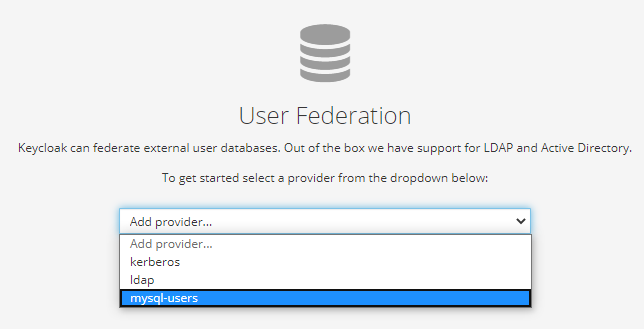

# keycloak-mysql-user-federation

Keycloak user federation extension to connect to a MySQL database containing users. For creating it I followed [this guide](https://www.keycloak.org/docs/latest/server_development/index.html#_user-storage-spi) from the official documentation.

## Installation

Clone the repository:

`git clone https://github.com/kyrcha/keycloak-mysql-user-federation.git`

Build the fat jar:

`gradle shadowJar`

Instruction for installing gradle build system can be found in the [official docs](https://gradle.org/).

I am using the [Gradle Shadown Plugin](https://imperceptiblethoughts.com/shadow/) to generate a fat jar containing all dependencies inside the jar file so that they are bundled together when deployed to keycloak.

Have a Keycloak running server. I am using docker here:

`docker run -p 8080:8080 --name keycloak_sso -e KEYCLOAK_USER=admin -e KEYCLOAK_PASSWORD=admin quay.io/keycloak/keycloak:10.0.1`

Copy the jar file inside the standalone folder:

`docker cp build\libs\keycloak-mysql-user-federation-all.jar keycloak_sso:/opt/jboss/keycloak/standalone/deployments/keycloak-mysql-user-federation.jar`

Keycloak should load the jar:

Go to user federation and choose the User Federation:

Add the following properties:

- The database connection
- The table containing the users
- The column with the username
- The column with the password
- The hash algorithms: MD5 or SHA1

Save and test.
